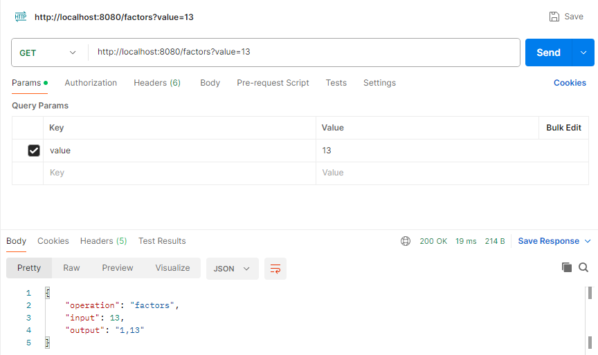
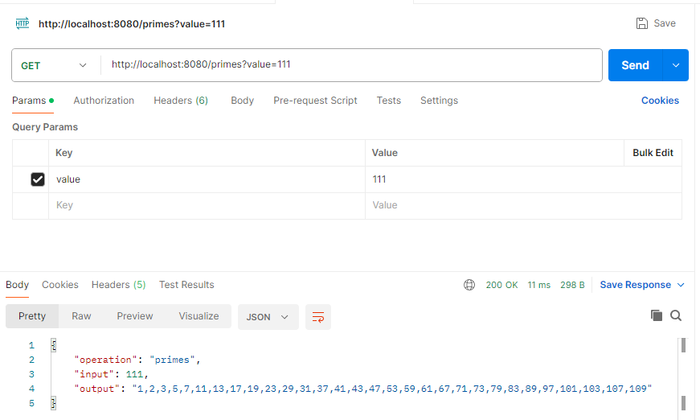
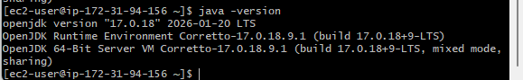
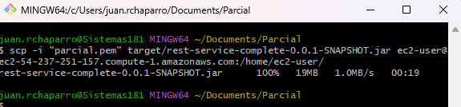
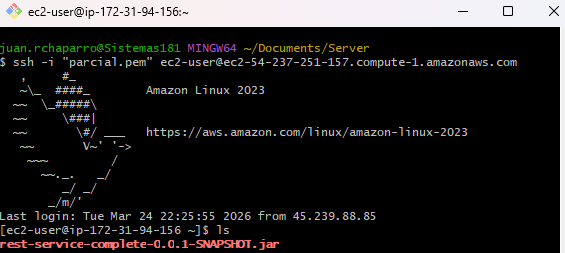
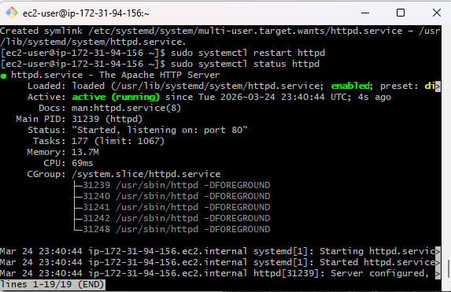
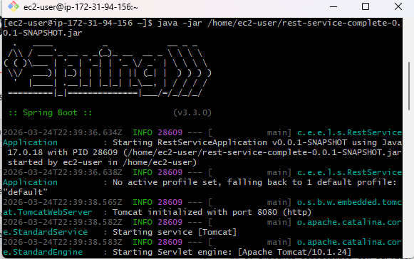
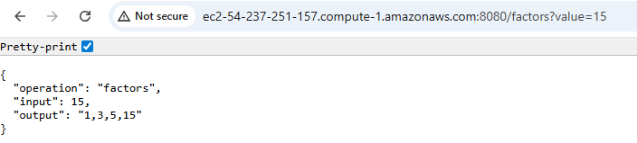
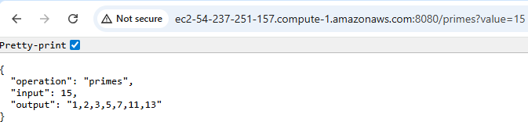

# Parcial-2Tercio-TDSE

## 1. Desarrollo de Backend Factores y Primos

Para esta seccion se desarrollaron 2 modulos controller (enpoints) y service (Logica)

Con el pom proporcionado por el profesor pudimos desarrollar de forma satisfactoria el laboratorio ya que este tenia las dependencias necesarias para la aplicacion y el desarrollo de los problemas
A continuación adjuntare evidencias del desarrollo local 

- `http://localhost:8080/factors?value=13`
  

- `http://localhost:8080/primes?value=111`
  

### 2. Instalación de Java 17 en servidor backend EC2

**Qué muestra:**
- Instalación de `java-17-amazon-corretto-headless`.
- Preparación del entorno para ejecutar Spring Boot.

### 3. Transferencia del JAR al backend y conexión SSH

**Qué muestra:**
- Comando `scp` para subir `est-service-complete-0.0.1-SNAPSHOT.jar` al EC2.
- Conexión remota para continuar despliegue de la aplicación.

---

## 4. Verificación de recepcion de archivo .jar
Con el comando `ls` verificamos que el archivo .jar llego al servidor

## 5. Configuración de proxy y servicios activos

**Qué muestra:**
- `apachectl configtest` con resultado correcto.
- Servicios activos: Apache en `443` y Java en `8443`.

---

## 6. Enpoints desplegados con servidor funcionando

### Para esto verificar esto antes tenemos que ejecutar nuestro archivo .jar con el comando 

- ` java -jar /home/ec2-user/rest-service-complete-0.0.1-SNAPSHOT.jar` 

- `http://ec2-54-237-251-157.compute-1.amazonaws.com:8080/factors?value=15`
  
- `http://ec2-54-237-251-157.compute-1.amazonaws.com:8080/primes?value=15`
  

## Stack Tecnológico

- **Backend:** Java 17, Spring Boot.
- **Infraestructura:** AWS EC2.

##  Autor

**Juan Miguel Rojas Chaparro**  
Escuela Colombiana de Ingeniería Julio Garavito  
Taller TDSE - Marzo 2026
